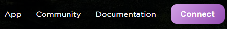
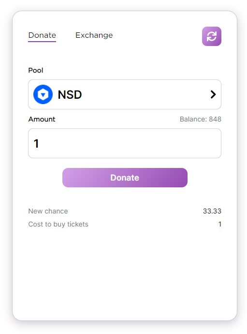
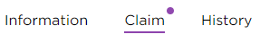
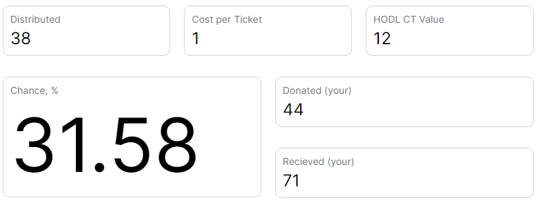

## Making a donation

### 1. Connect to Hubnate

Click on the `Connect` button located at the top of the site.

If you are using the mobile version, click on the `Connect` button located on the donation panel.

### 2. Making a donation

Each pool has its own characteristics. Select a pool from the list below.

Specify the number of tokens you want to donate. Please note that the cost of 1 chance token in different pools may differ. Click on the `Enable` button to allow you to spend your ERC-20 tokens. Next, click on the `Donate` button to make a donation.

### 3. Take away the CT tokens

After the donation is distributed, you can get the chance-tokens.
To do this, go to the `Claim` tab. This tab displays the rewards that you receive for your donations.

If you have uncollected rewards, the `Claim` button will be highlighted with a purple indicator.

To get CT tokens, click on the `Claim` button.

Please note that if you have a high chance of receiving a donation, your donation can be returned to you. In this case, you will not be able to get the chance tokens.

### 4. Make sure that the chance has increased

Go back to the `Information` page and make sure that your chance of getting the next donation has increased.
