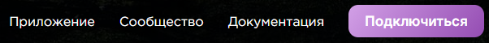
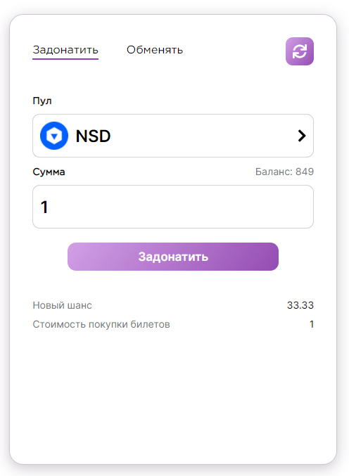
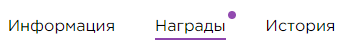
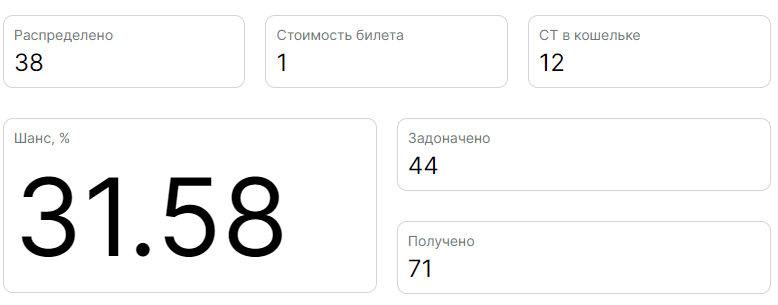

## Совершение доната

### 1. Подключитесь к Hubnate

Нажмите на кнопку `Подключиться`, находящуюся в верхней части сайта.

Если Вы используете мобильную версию, нажмите на кнопку `Подключиться`, находящуюся на панеле совершения доната.

### 2. Совершение доната

Каждый пул имеет свои характеристики. Выберите пул среди представленных. 

Укажите количество токенов, которое Вы хотите пожертвовать. Обратите внимание, что стоимость 1 шанс-токена в разных пулах может отличаться. Нажмите на кнопку `Включить пул`, чтобы разрешить потратить Ваши ERC-20 токены. Далее нажмите на кнопку `Задонатить`, чтобы совершить донат.

### 3. Заберите CT-токены

После того, как донат будет распределен, Вы можете получить шанс-токены.
Для этого необходимо перейти на вкладку `Награды`. На данной вкладке отображаются награды, которые Вы получаете за свои донаты.

Если у Вас есть несобранные награды, кнопка `Награды` будет подсвечена фиолетовым индикатором.

Чтобы получить CT-токены, нажмите на кнопку `Забрать`.

Обратите внимание, что если у Вас большой шанс получения доната, Ваш донат может вернуться Вам же. В таком случае Вы не сможете получить шанс-токены.

### 4. Убедитесь, что шанс увеличился

Перейдите вновь на страницу с пулами и убедитесь, что Ваш шанс получения следующего доната увеличился.
